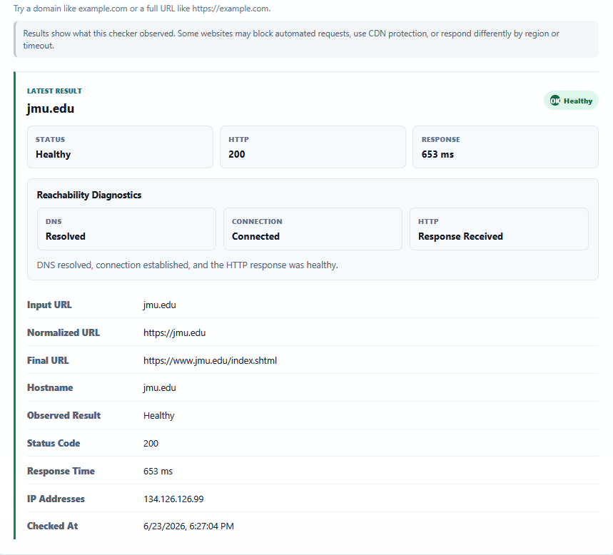
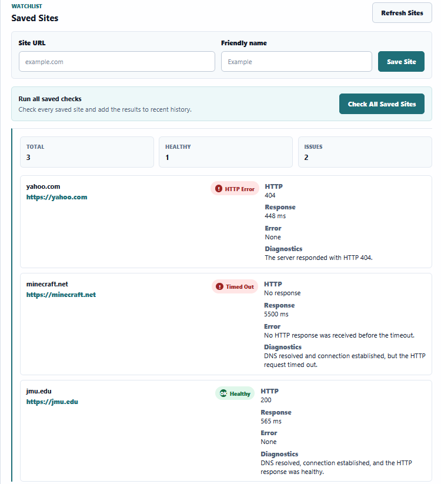
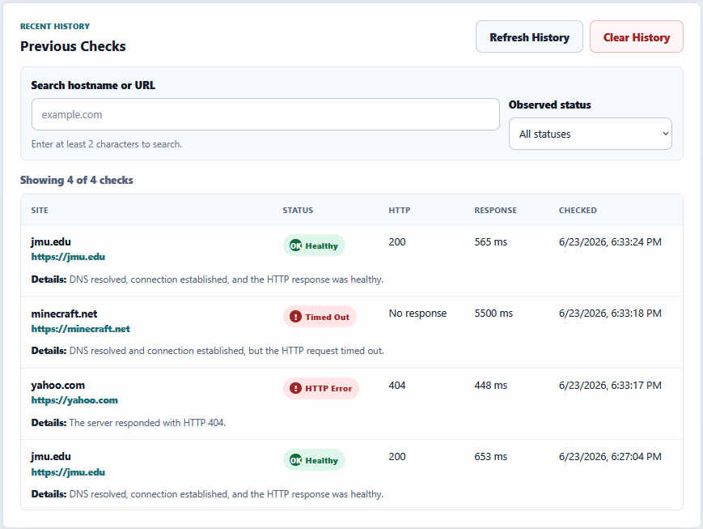

# Site Health Monitor

[](https://github.com/jawshfn/site-health-monitor/actions/workflows/ci.yml)

Site Health Monitor is a full-stack monitoring dashboard for checking what a local HTTP checker observes when it reaches a website. It reports response time, redirects, DNS/IP information, saved check history, watchlist checks, observed status labels, and multi-stage diagnostics for DNS, TCP connection, and HTTP response behavior.

The app is designed as a portfolio project: practical enough to use locally, small enough to understand quickly, and tested through a GitHub Actions CI workflow.

**Live demo:** [https://jawshfn.github.io/site-health-monitor/](https://jawshfn.github.io/site-health-monitor/)

The live GitHub Pages demo is frontend-only. Live website checks, saved sites, history, and dashboard data require the FastAPI backend to be running locally unless a backend is deployed separately later.

## Screenshots

### Latest result diagnostics



### Check all saved sites



### History filtering and search



## Features

* Check a website's observed availability, HTTP status, response time, redirects, and DNS/IP information
* Show multi-stage reachability diagnostics for DNS, TCP connection, and HTTP response stages
* Classify observed results as healthy, HTTP error, timeout, DNS failure, connection failure, invalid URL, or unknown error
* Save monitored sites in a SQLite-backed watchlist with duplicate prevention and editable friendly names
* Check one saved site or check all saved sites at once
* View dashboard summary cards for saved sites, total checks, latest healthy/issues counts, and average response time
* Store check history locally with pagination, status filters, hostname/URL search, and clear-history support
* Use a responsive React frontend with readable result cards, status badges, saved-site controls, and history layout
* Run backend tests and frontend builds automatically with GitHub Actions CI
* Deploy the frontend-only React demo to GitHub Pages

## Tech Stack

**Backend**

* Python
* FastAPI
* Pydantic
* httpx
* SQLite
* pytest

**Frontend**

* React
* Vite
* JavaScript
* CSS

**Tooling**

* GitHub Actions
* Python 3.12 in CI
* Node 20 in CI

## Run Locally

### Backend

From the project root:

```powershell
cd backend
python -m venv .venv
.\.venv\Scripts\python.exe -m pip install --upgrade pip
.\.venv\Scripts\python.exe -m pip install -r requirements.txt
.\.venv\Scripts\python.exe -m uvicorn app.main:app --reload
```

The backend runs at:

```text
http://127.0.0.1:8000
```

FastAPI docs are available at:

```text
http://127.0.0.1:8000/docs
```

### Frontend

Open a second terminal from the project root:

```powershell
cd frontend
npm install
npm run dev
```

The frontend runs at the URL shown by Vite, usually:

```text
http://127.0.0.1:5173
```

The backend must be running for website checks, saved sites, history, and dashboard summary data to load.

For a custom deployed backend, build the frontend with `VITE_API_BASE_URL` set to the backend URL. Local development defaults to `http://127.0.0.1:8000`.

## Testing and CI

Run the backend tests from the `backend/` folder:

```powershell
.\.venv\Scripts\python.exe -m pytest
```

Build the frontend from the `frontend/` folder:

```powershell
npm run build
```

GitHub Actions runs the backend test suite with Python 3.12 and the frontend production build with Node 20 on every push and pull request. A separate Pages workflow deploys the static frontend from `frontend/dist` on pushes to `main`.

## API Overview

| Method   | Endpoint                                               | Description                                      |
| -------- | ------------------------------------------------------ | ------------------------------------------------ |
| `GET`    | `/api/health`                                          | Check whether the backend is running             |
| `GET`    | `/api/summary`                                         | View dashboard totals from local SQLite data     |
| `POST`   | `/api/check`                                           | Check one website and save the result to history |
| `GET`    | `/api/history?limit=10&offset=0`                       | View paginated and filterable check history      |
| `GET`    | `/api/history?status_label=timeout&search=example`     | Filter history by observed status and search     |
| `DELETE` | `/api/history`                                         | Clear saved check history                        |
| `GET`    | `/api/sites`                                           | List saved monitored sites                       |
| `POST`   | `/api/sites`                                           | Save a monitored site                            |
| `PATCH`  | `/api/sites/{site_id}`                                 | Edit a saved site's friendly name                |
| `DELETE` | `/api/sites/{site_id}`                                 | Delete a saved monitored site                    |
| `POST`   | `/api/sites/check-all`                                 | Check every saved monitored site                 |

Example website check request:

```json
{
  "url": "example.com"
}
```

Example website check response:

```json
{
  "input_url": "example.com",
  "normalized_url": "https://example.com",
  "final_url": "https://example.com",
  "hostname": "example.com",
  "is_up": true,
  "status_label": "healthy",
  "failure_type": null,
  "failure_stage": null,
  "dns_status": "resolved",
  "connection_status": "connected",
  "http_status": "response_received",
  "diagnostic_summary": "DNS resolved, connection established, and the HTTP response was healthy.",
  "status_code": 200,
  "response_time_ms": 123,
  "ip_addresses": ["93.184.216.34"],
  "checked_at": "2026-06-23T12:00:00+00:00",
  "error": null
}
```

History supports `limit`, `offset`, `status_label`, and `search`. Use `status_label=issue` to return all non-healthy observed results. Search terms shorter than 2 characters are ignored.

## Notes About Observed Results

Site Health Monitor reports what this local checker observed. It does not prove that a website is globally down.

Some sites may block automated requests, use CDN or bot protection, respond differently by region, or time out from this checker while still loading normally in a browser. The diagnostic fields are meant to explain which stages succeeded or failed: DNS lookup, TCP connection, and HTTP response.

## Local Data

Website check history and saved monitored sites are stored locally in SQLite. Database files are intentionally ignored by git so local runtime data is not committed.

Ignored database file types include:

```text
*.db
*.sqlite
*.sqlite3
```

## Roadmap

Planned improvements:

* Per-site detail summaries
* Response time trends
* Deployment notes
